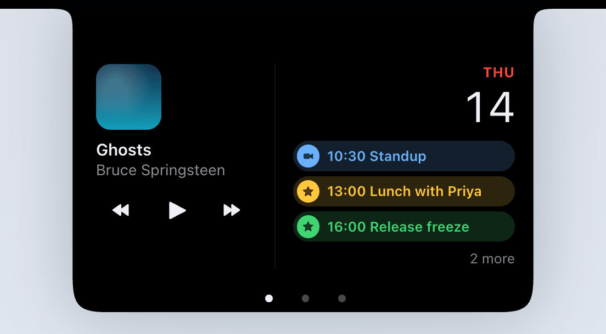
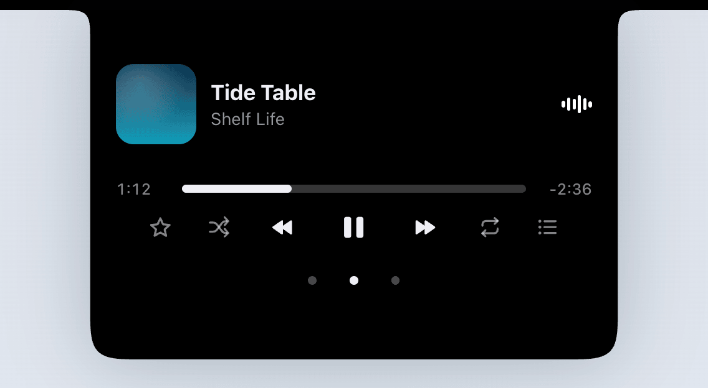
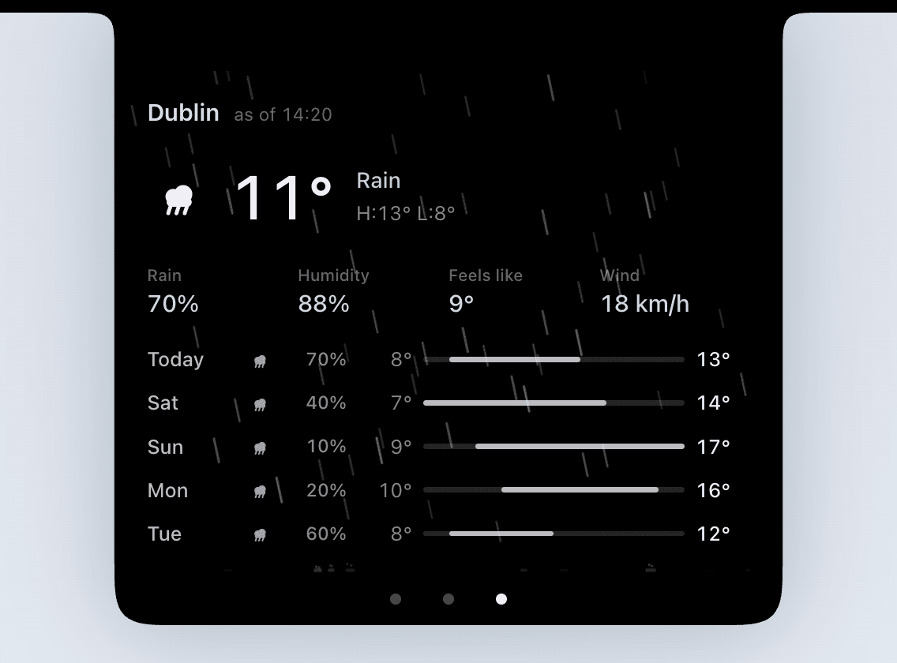
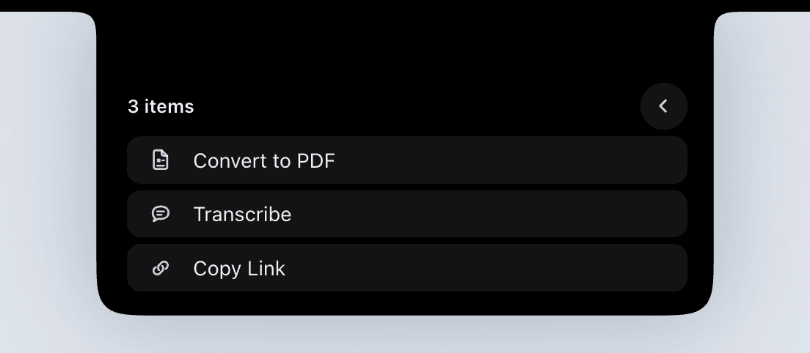

<div align="center">


# Isleta

### The notch, finally doing something.

**A Dynamic Island for your Mac — free, private, and open source.**

[tryisleta.com](https://tryisleta.com) &nbsp;·&nbsp; [What's new](release-notes/) &nbsp;·&nbsp; [Contributing](CONTRIBUTING.md)

[](LICENSE)


[](https://github.com/sponsors/idevtim)

<br>



</div>

---

Your MacBook has a black rectangle at the top of the screen that does nothing. Isleta turns it into
a live surface — your day, your music, your files and your battery, in the one place that was
already dark.

It stays invisible until it has something to say. Move your pointer onto the notch and it wakes up.

**No account. No subscription. No ads. No tracking. Free, and the whole thing is
[open source under the MIT License](LICENSE).**

<br>

<div align="center">

### [⬇︎  Download Isleta](https://github.com/idevtim/isleta/releases/latest)

macOS 26 or later · Apple silicon

</div>

---

## What you get

### 📅 Today — your day at a glance

*(that's the shot at the top of this page)*

What's next in your calendar and what the sky is doing, side by side. If the next thing is a
video call, there's a button that joins it — Zoom, Meet, Teams and the rest, read straight out of
the invitation. You pick which calendars count.

### 🎵 Music — without switching apps



Album art on one side of the notch, an equalizer that actually moves with the music on the other.
Play, pause, skip, shuffle, favorite, and see what's coming **Up Next** — double-click anything in
the queue to jump to it. Works with Apple Music, Spotify, and anything else that reports to macOS.

Long titles scroll once and settle instead of sliding forever. The artwork lends the island its
color. Track changes crossfade in place, so the island never flickers open and shut.

### 🌤 Weather — and it rains inside the island



Today's high and low, what it feels like, and the chance of rain for the next few days. Use your
location, or just type a city.

When it's raining outside, it rains **inside** the island, and the drops land on its bottom edge
instead of fading away. Snow falls too. Both stop if you've asked macOS to reduce motion.

### 📂 The shelf — drop files on the notch



Drag a file onto the notch and it waits there until you've found where it belongs. While it's
there, the island can also:

- **Convert it** — images, images to PDF, video, audio, Word, RTF, HTML, spreadsheets, slides
- **Transcribe it** — drop audio or video and the text lands beside the original. Nothing is
  uploaded and nothing is asked of you
- **Copy a link** — a shareable iCloud link on your clipboard, or AirDrop for files outside iCloud

Search the shelf, preview with the space bar, and look back at everything it's made for you. It
survives a restart.

### 🎧 AirPods and other devices


Take your AirPods out of the case and the island says hello with a ring showing how much charge is
left, then gets out of the way. The ring turns amber below 20%. AirPods, AirPods Pro, AirPods Max
and Beats get their own picture; everything else gets a generic pair.

### 🔊 Volume, mute and brightness

The level you just set, shown where your eyes already are. Press past the end of the range and the
bar leans off its own edge, so a key that does nothing still tells you so.

Isleta can also **answer the keys itself** and replace Apple's own HUD entirely — volume and
brightness are separate switches, both off until you turn them on.

### ⏱ And the small stuff that just shows up

- **Timers** you start in Clock, counting down beside the notch in Clock's own ring
- **Battery and power** — the charger going in and out, a low battery, Low Power Mode
- **A call in progress**, and how long it's been going
- **Welcome back** — a greeting on wake, in the right language for the hour
- **Screen sharing**, so you know when you're being watched
- **A lock screen card** showing what's playing (off until you turn it on)

### 🌍 Four languages

English, German, French and Spanish, following whatever your Mac is set to.

---

## How you use it

At rest, Isleta *is* the notch — pure black, filling the cutout, invisible on purpose. Arriving with
the pointer is what announces it: the island swells a few points past the notch and the trackpad
taps once under your finger.

| Do this | Get this |
|---|---|
| Move the pointer onto the notch | It peeks — an invitation to click |
| Click | It opens |
| **Swipe two fingers sideways** | Turn the page: Today → Music → Weather, and around again |
| Drag a file onto it | The shelf opens and takes it |
| Flick a closed island sideways | Whatever's on stage stows out of the way. Click to bring it back |
| Swipe up with two fingers | It closes |
| Right-click it | Isleta's own menu, and the way into Settings |
| `esc` | It closes |
| `⌃⌥⌘I` | Open and close it from anywhere (you can change this) |

**A few things worth knowing:**

- There's no Dock icon and no window — Isleta lives in the menu bar, and you can hide that icon too
- Clicking the island never steals focus. No title bar flicker, no lost cursor in the thing you
  were typing
- The first launch walks you through eight short screens. Five are permissions, each explaining
  what it's for *before* it asks. Skip any of them and the rest of Isleta still works
- You can give it a list of apps to stay out of entirely — handy for full-screen video or a
  presentation

---

## Will it run on my Mac?

**You'll need macOS 26 or later on Apple silicon.**

- ✅ **MacBook Pro or MacBook Air with a notch** — this is Isleta's home. The island lives in the
  cutout.
- ✅ **Plug in as many external displays as you like.** The island stays on the laptop, because an
  external monitor has no cutout to be continuous with — an island up there would just be a black
  rectangle stuck to the top of the screen.
- ⚠️ **Mac mini, Mac Studio or iMac** — no notch anywhere, so you get a floating island pinned to
  the top of your main display instead.

Isleta is a **direct download**, signed with an Apple Developer ID and notarized by Apple. It
updates itself. It is not on the Mac App Store, because it needs Accessibility and a small helper
process to read what's playing, and the App Store sandbox allows neither.

---

## Your privacy

This is the short version, and it really is the whole version:

- ❌ No account, ever
- ❌ No telemetry, no analytics, no crash reporting service
- ❌ Nothing about you, your music, your location or your calendar leaves your Mac
- ✅ **Transcription runs entirely on your Mac.** Audio never leaves it
- ✅ Your settings are a small file in your own user library
- ✅ Isleta keeps a log at `~/Library/Logs/Isleta` — events only, never track titles, file names,
  event titles or serial numbers. That's what makes **Export Logs…** safe to email to a stranger
- ✅ **Exactly two kinds of network request exist**: the weather, and checking for a new version.
  Both are switches. Turn them off and Isleta never touches the network at all

And since it's open source, you don't have to take any of that on faith — the code is right here.

---

<details>
<summary><strong>What Isleta asks permission for (and what happens if you say no)</strong></summary>

<br>

Isleta asks for as little as it can, as late as it can. Every request comes from a button *you*
press — never at launch.

| Permission | Needed for | If you decline |
|---|---|---|
| **None at all** | Volume, mute and brightness, timers, the shelf, file conversion, transcription, the wake greeting, power, hover, haptics, the shortcut | — |
| **Accessibility** | Answering the media keys, and replacing Apple's HUD if you ask it to | The island still shows the level; it just can't take the key |
| **Automation** (Music / Spotify) | A one-shot "what's playing right now?" read at launch | You lose the first track of a session, nothing else |
| **Calendar** | Today's events, meeting links, calendar alerts | Today shows the weather half only |
| **Location** | Weather where you are | Type a city instead — same weather, no location |
| **Bluetooth** | Hearing a device connect, so AirPods can say hello | No device ever appears; nothing else changes |

Each one is explained in Settings, right beside the switch it belongs to.

</details>

<details>
<summary><strong>Settings — what's on each pane</strong></summary>

<br>

| Pane | What's on it |
|---|---|
| **General** | Launch at login, shortcuts, whether Isleta shows in the menu bar, the lock screen card, the apps it stays out of, updates |
| **Sources** | Turn each thing on or off independently — Now Playing, the HUDs, Today, calendar alerts, meetings, timers, Bluetooth, power, calls, the shelf, the wake greeting, screen sharing |
| **Glance** | Which calendars count, and whether weather uses your location or a city you type |
| **About** | Acknowledgements, Export Logs…, Setup Guide, Quit, reset to defaults |

There are two keyboard shortcuts. **Open the island** ships bound to `⌃⌥⌘I`; **Show glance** starts
unassigned. Only the first gets a key out of the box, because Isleta has no Dock icon and its menu
bar item can be hidden — you need one guaranteed way back in. Everything else is a key taken away
from some other app on your Mac, so nothing claims one without being asked.

The shortcut recorder reads your real keyboard layout, so Dvorak and AZERTY users see the key they
actually pressed.

</details>

<details>
<summary><strong>Honest limitations</strong></summary>

<br>

- **You can't see who's calling.** macOS doesn't let apps outside Apple read that. Isleta shows
  that a call is happening, and nothing more.
- **A device's battery is read once, when it connects.** It doesn't tick down while you wear them —
  macOS gives no signal when the level changes, and Isleta won't poll for one. Most non-Apple
  headphones report no level at all.
- **A timer started by Siri, Shortcuts or Control Center can take a few seconds to appear.** One
  started by hand in Clock is instant. macOS gives no signal for the others.
- **Replacing the system HUDs needs Accessibility, and is off until you turn it on.** Quitting
  Isleta hands your keys straight back. Brightness covers the built-in display only.
- **The island sits above Mission Control.** In a real notch it covers nothing; a floating island
  can sit over the middle of the space labels.
- **The hover target is the notch itself** — about 185 points wide, and easy to overshoot.

</details>

---

## Open source

Isleta is **free software under the [MIT License](LICENSE)**. You can read it, build it, fork it,
learn from it, or ship your own thing with it.

- 🐞 **Found a bug?** [Open an issue](https://github.com/idevtim/isleta/issues)
- 💡 **Got an idea?** [Start a discussion](https://github.com/idevtim/isleta/discussions)
- 🔧 **Want to help?** [**CONTRIBUTING.md**](CONTRIBUTING.md) has setup, the house rules and the
  performance budget
- 🔒 **Security issue?** Email **security@idevtim.com** rather than opening an issue —
  see [SECURITY.md](SECURITY.md)
- 🤝 **Ground rules** — [CODE_OF_CONDUCT.md](CODE_OF_CONDUCT.md). Short version: be decent.
  Technical disagreement made in good faith isn't a conduct matter — bring the measurement

Hardware quirks are especially useful to hear about: a display arrangement that confuses it, a
music app it doesn't recognize.

### Build it yourself

You do **not** need an Apple developer account. Debug builds are ad-hoc signed and work with no
certificate at all.

```sh
git clone https://github.com/idevtim/isleta.git
cd isleta
./Tools/check.sh
open .build/xcode/Build/Products/Debug/Isleta.app
```

`Tools/check.sh` is the whole check — it builds and tests every package, runs the localization
audit, builds the app, then audits the built app. There's no package manager to install and no
code generation step: the five local SwiftPM packages and both vendored dependencies are already
in the tree.

Two things that will otherwise look like bugs in your own build: **Debug builds have no weather**
(WeatherKit needs an entitlement an ad-hoc signature can't carry), and you should **launch with
`open -a`, not from the shell** (macOS judges permission requests against the *responsible*
process, so an app started from a terminal inherits the terminal's grants). Both are explained in
[CONTRIBUTING.md](CONTRIBUTING.md).

<details>
<summary><strong>How the code is laid out</strong></summary>

<br>

Five local SwiftPM packages plus a thin app shell. The layering test: **anything in `IslandUI` must
build and preview with no permission granted.**

```
Isleta.xcodeproj      thin app shell target
Isleta/               app sources — wiring only, plus the self-tests
Config/               Info.plist and entitlements
Packages/
  IslandKit           window, panel, screen geometry, hit testing, haptics   (AppKit)
  IslandUI            SwiftUI views, shapes, motion tokens, activity content
  IslandActivities    activity protocol, the pure ActivityStack, coordinator
  IslandSources       Now Playing, HUDs, calendar, weather, Bluetooth, system events
  IslandSettings      config model, persistence, settings window, Sparkle seam
Vendor/               mediaremote-adapter; Sparkle's LICENSE only — see its README
Tools/check.sh        build + test everything the way CI should
Tools/release.sh      sign, notarize, regenerate the appcast (maintainer only)
appcast.xml           the Sparkle update feed, served raw from this repo
docs/                 the record: architecture, traps, platform constraints, motion
release-notes/        one file per shipped version
```

Every package has a `README.md` saying what it owns **and what it deliberately does not**.

**The docs are the interesting part.** Almost every entry in them was measured on real hardware,
most of it after a session was lost to the thing it warns about. `docs/PLATFORM-CONSTRAINTS.md` and
`docs/TRAPS.md` in particular are a long list of macOS APIs that return `success` and do nothing.
`CLAUDE.md` is the map that says which file to read before touching which area. `docs/PROGRESS.md`
records what was **withdrawn** as carefully as what shipped, because a removed feature is a
decision a later reader has to be able to find.

</details>

---

## Support the project

Isleta is a one-person project, and it's free. If it earns its place in your notch:

❤️ [**GitHub Sponsors**](https://github.com/sponsors/idevtim) &nbsp;·&nbsp; ☕ [**Buy Me a Coffee**](https://buymeacoffee.com/idevtim) &nbsp;·&nbsp; ⭐ **Or just star the repo** — it genuinely helps

---

## License and thanks

**[MIT](LICENSE)** © 2026 Timothy Murphy.

The vendored dependencies keep their own licenses:

- [**mediaremote-adapter**](https://github.com/ungive/mediaremote-adapter) by Jonas van den Berg and
  contributors — reads Now Playing, BSD 3-Clause
- [**Sparkle**](https://github.com/sparkle-project/Sparkle) — updates, MIT

Both are reproduced in `Vendor/`.

---

<div align="center">

**© 2026 Isleta** • Made by [Timothy Murphy](https://idevtim.com) • [tryisleta.com](https://tryisleta.com)

</div>
